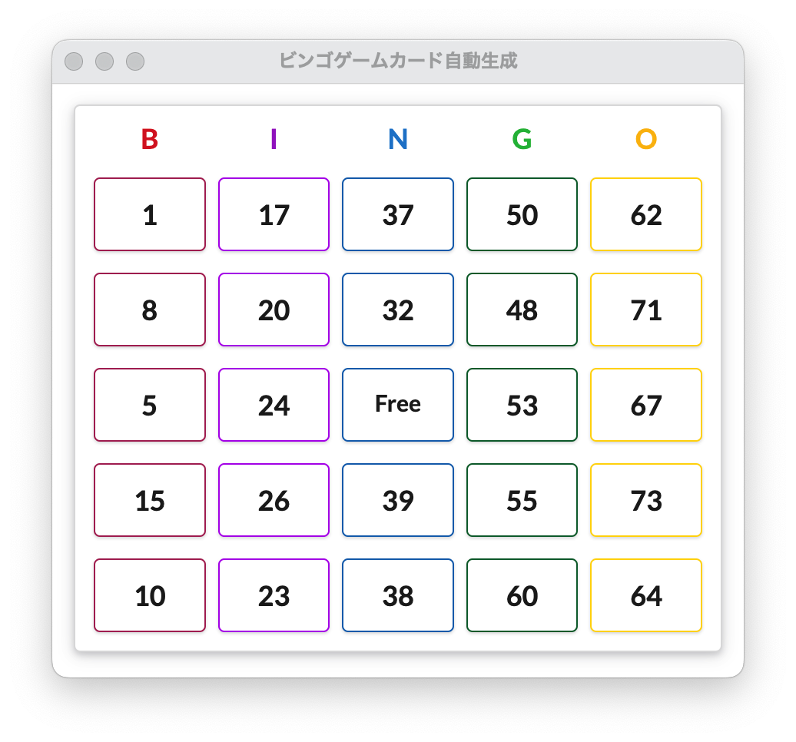

# ビンゴカード生成

社会情報実践 制作物 No. 2

要件
[REQUIREMENTS.md](./documents/REQUIREMENTS.md)

---

## インストール方法

[Release](https://github.com/waiwai2525/bingo-card-generator/releases)から最新のインストーラーをダウンロードしてください。

## 使い方

アプリを起動するごとに、新しいビンゴカードが生成されます。

状態の保存とクリック機能は今後実装予定です。
